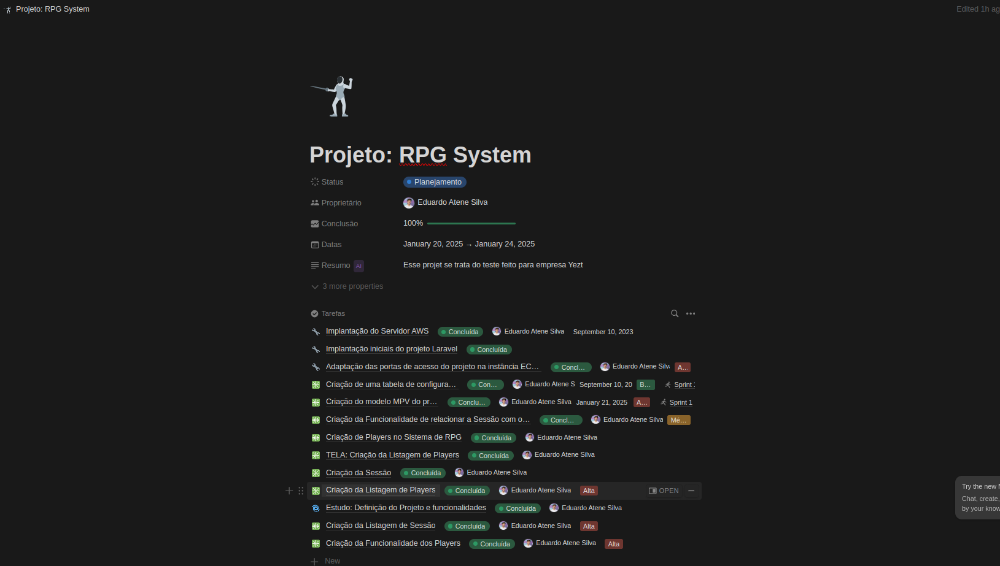
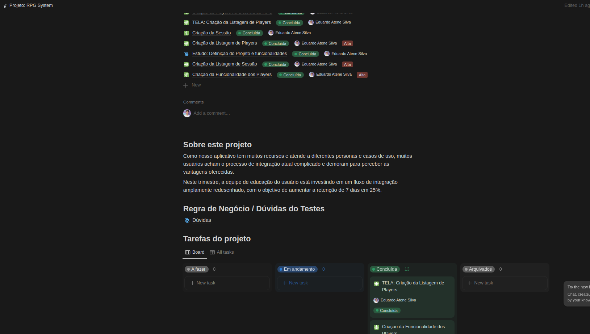
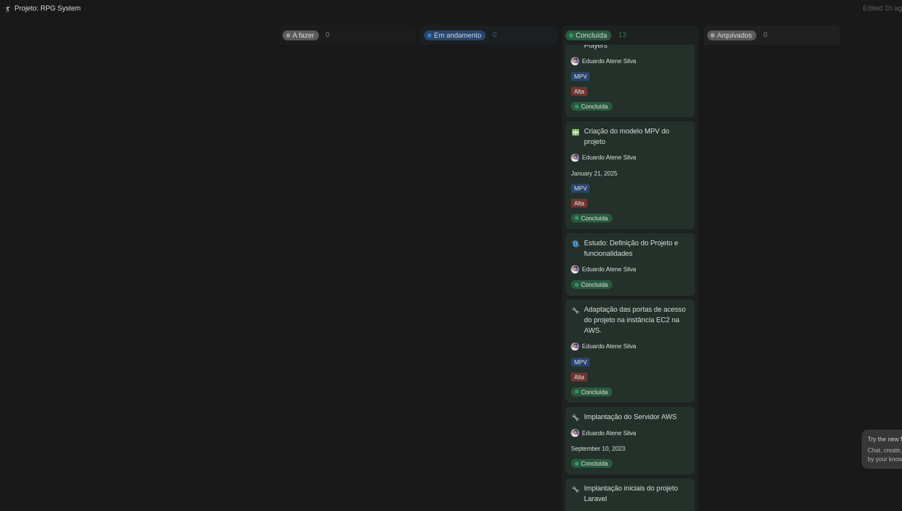
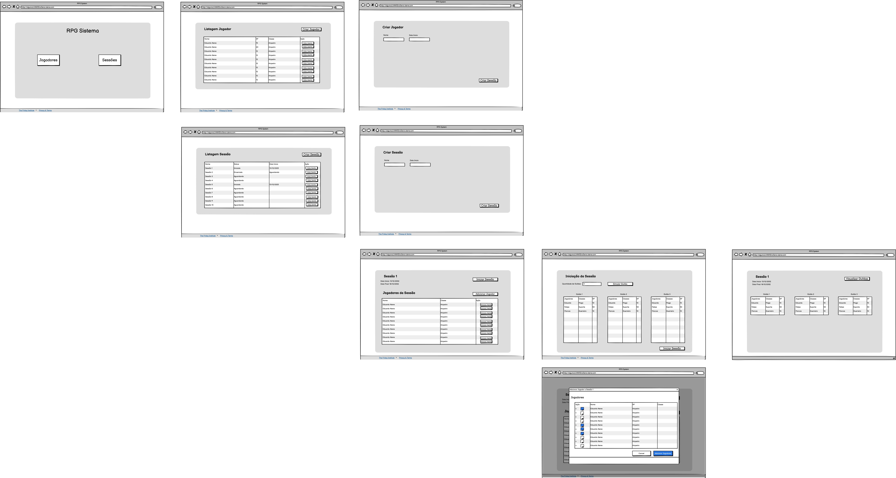

# Projeto RPG

## Visão Geral

Este projeto foi desenvolvido para criar uma aplicação web que gerencia e balanceia guildas de jogadores de RPG, equilibrando classes e pontos de experiência (XP). A solução foi feita pensando em um backend no **Laravel** com um frontend em **React**, hospedados na infraestrutura **AWS**.

---


---

## Rotas do Projeto

### Links de Produção

- **Frontend**: [http://54.207.73.103/](http://54.207.73.103/)
- **Backend (API)**: [http://54.207.73.103:8080/api](http://54.207.73.103:8080/api)
- **phpMyAdmin**: *(Somente IP Autorizado)* [http://54.207.73.103:8081/](http://54.207.73.103:8081/)

---

### Endpoints Disponíveis

#### **Players**
- **GET /players**: Lista todos os jogadores.
- **GET /players/classes**: Lista todas as classes disponíveis.
- **GET /players/{id}**: Retorna um jogador pelo ID.
- **POST /players**: Cria um novo jogador.
- **PUT /players/{id}**: Atualiza informações de um jogador.
- **DELETE /players/{id}**: Remove um jogador.

#### **Sessions**
- **GET /sessions**: Lista todas as sessões de RPG.
- **GET /sessions/{id}**: Retorna uma sessão pelo ID.
- **POST /sessions**: Cria uma nova sessão de RPG.
- **PUT /sessions/{id}**: Atualiza uma sessão existente.
- **PUT /sessions/{id}/init**: Inicia uma sessão.
- **PUT /sessions/{id}/close**: Encerra uma sessão.
- **DELETE /sessions/{id}**: Remove uma sessão.

#### **Guilds**
- **GET /guilds/{id}**: Retorna informações de uma guilda pelo ID.
- **GET /guilds/sessions/{id}**: Lista as guildas de uma sessão.

#### **Simulação e Confirmação de Guildas**
- **POST /simulate-guilds**: Simula a distribuição de jogadores entre guildas.
- **POST /simulate-guilds/confirm**: Confirma a simulação de guildas.

#### **Players em Sessão**
- **GET /sessions/{id}/players?associated={bool}**: Lista jogadores associados ou não associados à sessão.
- **POST /sessions/{id}/players**: Associa jogadores a uma sessão.
- **DELETE /sessions/{id}/players**: Remove jogadores de uma sessão.

---

## Tecnologias e Funcionalidades  Principais do Projetoo

- **Infraestrutura**:
  - Hospedagem em instância EC2 da AWS com 30GB de armazenamento ( usei plano gratuito ).
  - Usei também o nginx para rodar o servidor, tanto o servidor de front e back.
- **Backend**:
  - Desenvolvido em Laravel, utilizando padrões de projeto como **Repository Pattern** e **Strategy Pattern**. Além tambem de fazer uma divisão bem definida dos modelos, pq foi necessário.
- **Frontend**:
  - Criado com React
- **Algoritmo de Balanceamento**:
  - Equilibra classes e pontos de experiência (XP) entre as guildas.
- **Wireframe**:
  - Utilização de wireframes para guiar o desenvolvimento e organização no Notion. Foi pensado no começo do projeto, mas  teve muita alteração.
- **Pipeline**:
  - Tentativa de implementação de integração via GitHub Actions, mas infelizmente não funcionou, por conta de configuração na AWS. Mas fica a tentativa.
- **Docker**:
  - Utilização de contêineres Docker para gerenciamento do ambiente de desenvolvimento.
  - **phpMyAdmin** configurado para auxiliar no gerenciamento do banco de dados via interface gráfica. Só uma ferramente complementar mesmo, pois estava utlizando o DBeaver também para conexão com o bd.

---

## Estrutura do Backend

A organização do backend segue esse estrutura abaixo:

```
app/
├── Helpers/               # Funções auxiliares.
├── Exceptions/            # Exceções.
├── Http/
│   ├── Controllers/       # Controladores para requisições.
│   ├── Resources/         # Tratamento para o retorno.
│   ├── Requests/          # Validação de entradas das requisiições em geral.
├── Interfaces/
│   ├── Repositories/      # Contratos para repositórios.
│   ├── Strategies/        # Contratos para strategiess.
├── Models/                # Entidades e seus relacionamentos.
├── Observers/             # Observadores eventos do Eloquent ( usei somente uma vez, mas não utilizei mais essa cada).
├── Repositories/          # Implementações dos contratos de repositórios.
├── Services/              # Lógica de negócio principal.
│   ├── Validation/        # Validação customizada para negócios.
│   ├── Strategies/        # Implementações das estratégias de lógica.         
├── Traits/                # Traits.
```

---

## Problemas/Desafios Enfrentados

1. **Infraestrutura**:
   - Eu nunca tinha configurado um ambiente do 0 na AWS. Já meche com os serviços, como SQS e Lambda da AWS, mas nunca fiz algo realmente do zero. Tive muito problemas no começo, para realizar a configuração da instância EC2. Isso inclui desde de subir o projeto, rodar ele, configurar docker e nginx. Teve até um momento que atingio o limite de 8GB a instância, ai tive que aumentar para 30GB. Mas isso foi um verdadeiro desafio para mim. Levo como aprendizado, por que é algo muito interessante de se mexer.
2. **Pipeline CI/CD**:
   - Eu tentei implementar o CI/CD do projeto, para tentar fazer deploy automático quando é merjado para main. Estava tentando fazer isso, pois eu tinha que toda hora entrar via terminal na instância da AWS e rodar o projeto e todas configurações se for necessária ( no caso, php artisan migrate e npm run build). Entretanto, acabei não conseguindo implementar a autenticação do Git Actions com a AWS. Desisti dessa ideia incialmente.
3. **Definição do Projeto e Banco de dados**:
    - Então, esse teste eu fiz diferente. Tentei planejar todas as tarefas antes, definir o banco de dados, o que foi utilizar, e acabou que isso me trouxe incialmente, uma clareza, mas depois vi que fiquei quase 2 dias fazendo isso ( segunda e terça ) que me tirou tempo para realmente fazer o projeto. Eu usei Notion para criar como se fosse uma "esteira" de produtos, poder me planejar. Então inicialmente, criei todas as "demandas" precisava fazer até finalziar o projeto. Mas isso me tirou muito tempo, mas muito tempo. Devia ter deixado isso de lado, me planejado o básico de como ter inicio do projeto, para depois entegrar.
4. **Definição Projeto Back-End**:
    - Em geral, foi um pouco custoso lembrar de alguns modelos do Laravel. Tive que buscar muito, para aplicar os padrões de projeto solicitado. Então foi um desafio em geral lembrar de várias coisas do Laravel. Acaba que atualmente estava fazendo muita coisa em golang, e tive que ir atrás de tudo. No fim das contas, acredito que defini um padrão de projeto interessante. Mas até definir a estrutura, tive dificuldades.
5. **Balanceamento de Guildas**:
   - Esse algoritmo foi o mais desafiador do projeto. Tentei pensar em uma ideia que resolve-se, mas cada vez mais dava divergência. Inicialmente, lembrei de alguns algoritmos que aprendi na faculdade, como a do problema da mochila e afins. Só que acabei nem utilizando essa solução. Pensei mesmo em ordenar por XP, depois dividir, fazer a distribuição incial, depois o balanceamento de XP. Acabou dando certo, mas ainda sim acredito que poderia melhorar muito esse algoritmo. Infelizmente, deixei pouco tempo para criar o algoritmo, e acabei penando nessa questão, pois se tive-se me planejado deixar mais tempo para fazer o algoritmo.
6. **Remodelação do Frontend**:
   - Inicialmente do projeto, estava fazendo o backend e front em unico projeto. Entretanto, depois vi que os blades do front não tava escalável e não estavam bons. Tentei dividir em ultima hora, o front, criando um projeto em front no react. Acaba que acredito que dei muito tempo nesse projeto do front, que poderia ser necessário converter esse tempo para aplicar no algoritmo de balanceamento das guildas. Mas ficou uma estrutura legal. Também tive que limpar o código.
7. **Configuração do Docker**:
   - Ajustes em geral no `docker-compose` tive algumas dificuldades, em integrar todos os serviços que tinha planejado (app, web, front, mysql e phpMyAdmin).

---

## Explicação da Lógica de Distribuição

A distribuição dos jogadores entre as guildas é feita considerando a classe e o XP de cada jogador, foi pensadu na lógica abaixo:

1. **Agrupar por Classe (Tipo de ação tb definido no projeto )**:

   - Os jogadores são separados em grupos de acordo com suas classes e ações. Em geral, ficou dividido 3 grupos, um contendo o Guerreiro, outro o Clérigo e por fim o Mago e Arqueiro.

2. **Ordenação por XP**:

   - Dentro de cada grupo, os jogadores são ordenados com base no XP, utilizando o algoritmo de ordenação por seleção (Selection Sort).

3. **Distribuição Inicial**:

   - Cada guilda recebe pelo menos um jogador de cada classe necessária (Clérigo, Guerreiro, e um atacante à distância- Mago ou Arqueiro).
   - Caso uma classe esteja ausente, é registrada como "classe faltante".

4. **Preenchimento das Guildas**:

   - Jogadores são distribuídos nas guildas até atingir o número máximo de jogadores por grupo, priorizando a diversidade de classes.
   - Pensada na distribuição incial.

5. **Balanceamento de XP**:

   - Jogadores faltantes são redistribuídos para minimizar a diferença de XP entre as guildas.
   - O algoritmo é aplicado e faz com que a guilda com menor XP total receba os jogadores com maior XP ainda disponíveis.

   

## Definição do Projet e Wireframe

### Imagens do Notion
As imagens abaiixo mostram como foi estruturada a "esteira" de desenvolvimento no Notion. Como falei, fiz esse teste iniciando diferente. Não foi uma boa, mas segue ai o contéudo que fiz:





Segue o link do notion. [Link NOtionn Compartilhado](https://www.notion.so/Projeto-RPG-System-182f6637250a8067951cdbb840290d1b?pvs=4)

### Wireframe do Projeto

Segue abaixo o wireframe utilizado para guiar o desenvolvimento. Mas teve muita alteração depois disso. Isos foi incial:



Da para ver no link tb, segue o link: [Wireframe](https://share.balsamiq.com/c/cNzyfGRJoiRcpcVtWMWDVS.jpg)

---


## Regras de Negócio e Dúvidas

### Fluxo de Criação de Players e Vinculação com Sessão

**Dúvida Inicial:**
- Como funcionaria o mecanismo do player e da sessão?
  - O mesmo player, com sua classe e XP, poderia participar de outra sessão? Ou cada sessão exigiria o cadastro do player novamente?

**Análise:**
- Existiam duas abordagens:
  1. **Cadastro Dependente de Sessão**:
     - Cada player deveria ser vinculado obrigatoriamente a uma sessão. Caso desejasse participar de outra sessão, seria necessário recriar o player.
  2. **Cadastro Independente de Sessão (Escolhida):**
     - Players são cadastrados de forma independente, podendo ser vinculados a diferentes sessões.
     - Essa abordagem permite maior flexibilidade, pois um player pode optar por participar apenas de determinadas aventuras.

**Motivação para a Solução Escolhida:**
- Um player pode ter preferências diferentes para as aventuras, como combater um monstro ou investigar uma casa assombrada.
- Garante maior reaproveitamento dos dados dos players.

### Regras de Negócio da Sessão
- A sessão poderá ter nome, data de inicio e descrição
- Cada sessão possui três status principais:
  1. **Waiting:** Sessão aguardando início.
  2. **In Progress:** Sessão em andamento, ativada após a simulação e confirmação das guildas.
  3. **Closed:** Sessão encerrada, sem mais alterações permitidas.
- Fluxo de status:
  - De **Waiting** para **In Progress**: Ocorre após a confirmação das guildas.
  - De **In Progress** para **Closed**: A sessão é finalizada manualmente pelo usuário.
- **Visualização dos Detalhes:**
  - Guildas e informações só podem ser acessadas em sessões com status **In Progress** ou **Closed**.

### Regras de Negócio das GUildas
- A Guilda poderá ter nome e quantidade X de pessoas
- A(s) Guildaa(s) só será criada no momento da simulação e depois confirmação.

### Nota Importante
- Todos os jogadores podem participar de todas as sessões, desde que sejam vinculados quando o status da sessão seja Waiting.

